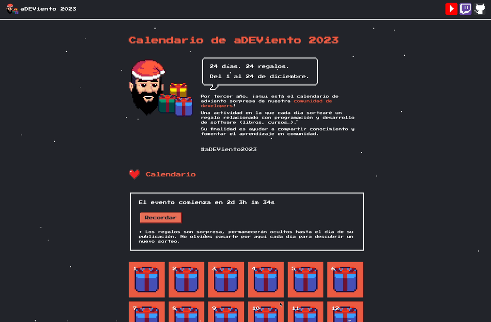

# Calendario de aDEViento Web

[](https://python.org)
[](https://reflex.dev)
[](https://nostalgic-css.github.io/NES.css)
[](https://vercel.com)

## Proyecto web "Calendario de aDEViento" con Python puro y Reflex



> El "Calendario de aDEViento" es una actividad en la que cada día (durante el adviento) se sortea un regalo relacionado con programación y desarrollo de software (libros, cursos…). Su finalidad es ayudar a compartir conocimiento y fomentar el aprendizaje en comunidad.

### Visita [https://adviento.dev](https://adviento.dev)

#### Desarrollo realizado en directo desde [Twitch](https://twitch.tv/mouredev)
> ##### Si consideras útil el proyecto, apóyalo haciendo "★ Star" en el repositorio. ¡Gracias!

## Tutorial en vídeo

<a href="https://youtu.be/h8Tn0ITRoQs"></a>

- [Introducción](https://youtu.be/h8Tn0ITRoQs)
- [Lección 1 - Configuración](https://youtu.be/h8Tn0ITRoQs?t=115)
- [Lección 2 - Navbar](https://youtu.be/h8Tn0ITRoQs?t=1547)
- [Lección 3 - Header](https://youtu.be/h8Tn0ITRoQs?t=2665)
- [Lección 4 - Footer](https://youtu.be/h8Tn0ITRoQs?t=4499)
- [Lección 5 - Instructions](https://youtu.be/h8Tn0ITRoQs?t=5207)
- [Lección 6 - Author](https://youtu.be/h8Tn0ITRoQs?t=5985)
- [Lección 7 - Partners](https://youtu.be/h8Tn0ITRoQs?t=7394)
- [Lección 8 - Calendar](https://youtu.be/h8Tn0ITRoQs?t=7821)
- [Lección 9 - Repository](https://youtu.be/h8Tn0ITRoQs?t=9077)
- [Lección 10 - Snow](https://youtu.be/h8Tn0ITRoQs?t=9679)
- [Lección 11 - Deploy](https://youtu.be/h8Tn0ITRoQs?t=9849)
- [Conclusiones](https://youtu.be/h8Tn0ITRoQs?t=11505)

> Tienes un canal llamado **"python"** en el servidor de **[Discord](https://mouredev.com/discord)** de la comunidad para preguntar, compartir y ayudar.

## Proyecto

Esta es la estructura general del proyecto.

* **adeviento_web**: código fuente principal
	* **adeviento_web.py**: index del sitio web
	* **constants.py**: constantes utilizadas en el sitio
	* **styles**: directorio de estilos (css, colores y fuentes)
	* **views**: directorio de vistas (secciones gráficas)
	* **components**: directorio de componentes (elementos gráficos con menor entidad que una vista)
* **assets**: recursos gráficos y utilidades JavaScript (nive y cuenta atrás)
* **rxconfig.py**: configuración principal del proyecto (por defecto)
* **requirements.txt**: dependencias del proyecto para su ejecución
* **assets**: recursos gráficos y utilidades JavaScript (nive y cuenta atrás)
* **local_build.sh**: script de generación estática de la web para producción en local
* **build.sh**: script de generación estática de la web para producción en remoto
* **[generado] public**: empaquetado estático del proyecto que se despliega en producción (HTML, CSS, JS e imágenes)

## Configuración en local

1. Haz un `Fork` del repositorio.

2. Clona ese repositorio en tu máquina local.

    ```bash 
    git clone https://github.com/<USERNAME>/adeviento-web.git
    ```

3. Navega al directorio del proyecto.

    ```bash
    cd adeviento
    ```

4. Crea un entorno virtual.

    ```bash
    python3 -m venv venv
    ```

5. Activa el entorno virtual.

    ```bash
    source venv/bin/activate
    ```

6. Instala las dependencias.

    ```bash
    python -m pip install -r requirements.txt
    ```

7. Inicializa el proyecto de Reflex.

    ```bash
    reflex init
    ```

8. Ejecuta el proyecto en local.

    ```bash
    reflex run
    ```

    *Podrás acceder a él entrando en la url `http://localhost:3000/` desde el navegador.*
    
> Tienes más la información sobre [Reflex](https://reflex.dev/) en su [documentación oficial](https://reflex.dev/docs).

## Despliegue

Para realizar el despliegue del proyecto se ha creado un archivo `local_build.sh` que se encarga de ejecutar el flujo necesario para generar el directorio `public` con todos los recursos estáticos que necesita el servidor web. 

Todo el proceso de empaquetado para producción podría ser delegado en el servidor, pero el repositorio cuenta siempre con el directorio `public` para que así puedas revisar el contenido estático de la web sin necesidad de ejecutar el script `local_build.sh`.

```bash
source .venv/bin/activate
pip install --upgrade pip
pip install -r requirements.txt
reflex init
reflex export --frontend-only
rm -fr public
unzip frontend.zip -d public
rm -f frontend.zip
deactivate
```

*Básicamente, prepera el entorno, instala dependencias, inicializa el proyecto, crea la construcción de producción, y la descomprime.*

Puedes configurar el servidor para que realice la tarea de empaquetado y despliegue ejecutando `build.sh`.

> El proyecto se puede desplegar en cualquier proveedor o servidor que soporte recursos estáticos.
> 
> [adviento.dev](https://adviento.dev) se encuentra desplegado en [Vercel](https://vercel.com).

Configuración en Vercel:

* Se ha asociado el repositorio de GitHub al proyecto (para que cada `push` en la rama `main` desencadene un nuevo despliegue)
* Build & Development Settings: Other
* Root Directory: `public` (que contiene el empaquetado estático para producción)
* Custom Domain: adviento.dev 

## Recursos utilizados


* Lenguaje: [Python](https://www.python.org/)
* Framework: [Reflex](https://reflex.dev/)
* CSS: [NES.css](https://nostalgic-css.github.io/NES.css/)
* Fuente: [Press Start 2P](https://fonts.google.com/specimen/Press+Start+2P)
* Hosting: [Vercel](https://vercel.com/)

## Curso de Python y Reflex

<a href="https://github.com/mouredev/python-web"></a>

Curso gratis para aprender desarrollo frontend Web con Python puro desde cero con Reflex. Las tecnologías usadas para desarrollar el proyecto del "Calendario de aDEViento". También tengo un curso de Python desde cero para principiantes.

[](https://github.com/mouredev/python-web)
[](https://github.com/mouredev/python-web)

#### Puedes apoyar mi trabajo haciendo "☆ Star" en el repo. ¡Gracias!

## Únete al campus de programación de la comunidad


#### Te presento [mouredev pro](https://mouredev.pro), mi proyecto más importante para ayudarte a estudiar programación y desarrollo de software de manera diferente.

> **¿Buscas un extra?** Aquí encontrarás mis cursos editados por lecciones individuales, para avanzar a tu ritmo y guardar el progreso. También dispondrás de ejercicios y correcciones, test para validar tus conocimientos, examen y certificado público de finalización, soporte, foro de estudiantes, reunionnes grupales, cursos exclusivos y mucho más.
> 
> Entra en **[mouredev.pro](https://mouredev.pro)** y utiliza el cupón **"PRO"** con un 10% de descuento en tu primera suscripción.

##  Hola, mi nombre es Brais Moure.
### Freelance full-stack iOS & Android engineer

[](https://youtube.com/mouredevapps?sub_confirmation=1)
[](https://twitch.com/mouredev)
[](https://mouredev.com/discord)
[](https://twitter.com/mouredev)


Soy ingeniero de software desde 2010. Desde 2018 combino mi trabajo desarrollando Apps con la creación de contenido formativo sobre programación y tecnología en diferentes redes sociales como **[@mouredev](https://moure.dev)**.

Si quieres unirte a nuestra comunidad de desarrollo, aprender programación, mejorar tus habilidades y ayudar a la continuidad del proyecto, puedes encontrarnos en:

[](https://twitch.tv/mouredev)
[](https://mouredev.com/discord) [](https://moure.dev)
[](https://moure.dev) [](https://github.com/mouredev)
